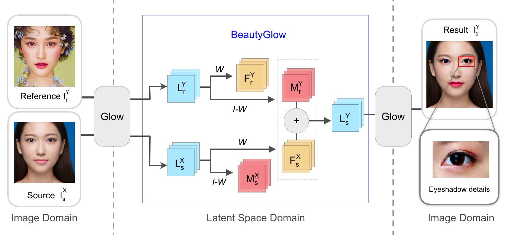

# BeautyGlow: On-Demand Makeup Transfer Framework with Reversible Generative Network
Implementation of "BeautyGlow: On-Demand Makeup Transfer Framework with Reversible Generative Network". The implementation is based on the [chainer implementation of Glow code](https://github.com/musyoku/chainer-glow).

## Getting Started
### Prepare Dataset

